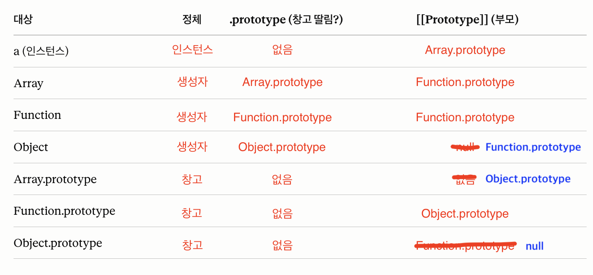

# JavaScript의 **proto**와 프로토타입 접근자 (getPrototypeOf / setPrototypeOf)

## 잘 알고 있는지

- 15일 프로토타입 공부([노트](./2026-07-15-수-JavaScript-프로토타입.md))에서 [[Prototype]] 슬롯 = "없으면 찾아갈 부모 링크"까지는 함

## 내가 아는 만큼 설명

- 🥺

## 답을 본 뒤 알게 된 것

### 0. 복습

- .prototype의 정체: "함수 객체의 일반 프로퍼티"(창고). 슬롯과 뭐가 다른가
  - 함수를 정의하는 순간, 엔진이 자동으로 그 함수에 .prototype 프로퍼티를 붙인다. 일반 함수에만 생기며, 화살표 함수에는 생기지 않는다.
  - new 될 수 있는 함수에만 생긴다.
  - Array/Function/Object = 엔진 시동 시 자동 생성. 코드 실행 전에 완비.
    [native code] = JS 정의가 아니라 엔진 내부(C++) 구현이라는 표시.
    전역 객체(window/globalThis)에 꽂혀서 어디서든 접근됨.
    어제 배운 부트스트랩이 바로 이 생성 순간에 순환참조를 푸는 과정.

- 표 백지에서 다시 써보기: a / Array / Function / Object / 각 .prototype



- constructor 위치: 몸통 아니라 생성자.prototype 창고에 삼

### 1. [[Prototype]] 꺼내는 법

- 사실, a.[[prototype]] 이렇게 꺼내는 건 안된다!

```js
const a = [1, 2, 3];
Object.getPrototypeOf(a) === Array.prototype; // true
```

1. 표준이다. obj의 부모 슬롯을 꺼내달라고 말하는 공식 메서드.

```js
a.__proto__ === Array.prototype; // true (똑같이 됨)
```

2. 1번과 같은데, 요즘은 deprecated.

- 표준이 아니었지만, 브라우저들이 각자 만들어 쓰던 것을 나중에 마지못해 넣은 것이라고 함.
- 프로토타입 오염의 통로.
- getPrototypeOf 는 함수지만, 이건 프로퍼티이기 때문에 쓰기가 가능. 이것이 취약점. 존재는 알되, 쓰지 마라.

```js
const parent = {
  greet() {
    return "안녕";
  },
};
const child = {};
Object.setPrototypeOf(child, parent); // child의 부모를 parent로
child.greet(); // "안녕"  ← 이제 parent에서 빌려옴
```

3. 슬롯 설정

- 성능 상 피해야 한다.
- 이미 만들어진 객체의 부모를 바꾸면 엔진의 최적화를 버리게 되어 느려짐(인라인 캐시)
- 부모를 정하려면 만들 때 정하라.

4. 정리

- 정리:
-
- 읽기: Object.getPrototypeOf(obj) — 표준, 이거 써.
- obj.**proto**: 같은 걸 하지만 비권장(레거시 + 오염 통로). 알되 안 씀.
- 쓰기: Object.setPrototypeOf 있지만 느려서 피함 → 만들 때 정하는 게 정석(3번).

### 2. 체인 직접 따라가기

- a → Array.prototype → Object.prototype → null : getPrototypeOf 세 번이면 바닥
- getPrototypeOf(Array.prototype) === Object.prototype → true (틀렸던 "없음" 반박됨)
- getPrototypeOf(Object.prototype) === null → true (바닥)
- 순환 구간: Dog → Function.prototype → Object.prototype → null, 슬롯만 타니 순환 없이 끝남
- 자기참조 열쇠: Function의 부모는 Function.prototype이지만, Function.prototype의 부모는 Function이 아니라 Object.prototype → 위로 탈출, 안 돎
- a.**proto** === getPrototypeOf(a) → true (둘이 같은 슬롯 꺼냄)

### 3. Object.create / setPrototypeOf

```js
const parent = {
  greet() {
    return "안녕";
  },
};

const child = Object.create(parent); // child의 부모 = parent (만들 때 확정)

child.greet(); // "안녕"  ← 자기엔 없지만 parent에서 빌려옴
Object.getPrototypeOf(child) === parent; // true    ← 2번에서 배운 걸로 확인
```

- `Object.create(proto)`
- [[Prototype]]이 proto인 새 객체를 만든다.
- child는 아무것도 갖고 있지 않음에도, greet() 할 수 있는 것은 프로토타입이 연결되었기 때문.
- 어제 적은 것: "new로 만들면 슬롯이 '우연히' 생성자의 .prototype을 가리키는 것뿐. Object.create(x)로 만들면 슬롯이 곧장 x를 가리킨다 — .prototype 안 거침."
- Object.create는 생성자도 .prototype도 안 거치고 슬롯을 곧장 원하는 객체로 꽂음. 제일 날것의, 순수한 프로토타입 연결.

```js
// ① Object.create — 슬롯 직접 지정 (제일 순수)
const c1 = Object.create(parent);
Object.getPrototypeOf(c1) === parent; // true

// ② new — 생성자의 .prototype을 슬롯에 꽂음 (한 다리 건넘)
function Dog() {}
Dog.prototype = parent; // 창고를 parent로
const c2 = new Dog();
Object.getPrototypeOf(c2) === parent; // true (같은 결과! 근데 Dog.prototype 경유)

// ③ setPrototypeOf — 이미 만든 객체의 슬롯을 나중에 갈아끼움
const c3 = {}; // 일단 평범한 객체 (부모 = Object.prototype)
Object.setPrototypeOf(c3, parent); // 나중에 부모를 parent로 교체
Object.getPrototypeOf(c3) === parent; // true (또 같은 결과!)
```

- 그렇다면, 부모 연결을 세 가지 방식으로 보자.
- 1번은 만들때 슬롯을 직접 연결하니 깔끔하고 빠르다.
- 2번은 생성자의 prototype을 경유한다.
- 3번은 만든 뒤 슬롯을 교체하고, 느리다. 최적화를 파괴.

```js
const bare = Object.create(null); // 부모가 null인 객체
Object.getPrototypeOf(bare); // null
bare.toString; // undefined  ← Object.prototype도 안 물려받음!
```

- 4번 이야기 살짝
- 이렇게 작성하면 Object.prototype도 없는 조상이 아예 없는 객체 생성됨! (이건 프로토타입 오염 방어)

### 4. **proto** <-> 프로토타입 연결 오염

- 프로토타입 오염에 대해
- 창고에 메서드는 1개. 그걸 모두가 나눠쓴다. 그렇기 때문에 빠르지만, 위험할 수 있다.

```js
Object.prototype.hacked = "뚫림"; // 최상위 창고에 심음

const a = {}; // 빈 객체. 아무것도 안 넣었어
a.hacked; // "뚫림"  ← 안 넣었는데 나옴!
```

- 모든 객체의 최상위 조상이 오염됨 = 전역 오염.

```js
const obj = {};
obj.__proto__.polluted = "감염"; // obj의 부모(=Object.prototype)에 심음

({}).polluted; // "감염"  ← 완전 무관한 새 객체도 감염됨
```

- obj.**proto**를 타고 올라가 Object.prototype에 값을 심음.
- **proto**가 오염의 통로라는 게 이것
- getPrototypeOf는 함수라 이런 쓰기가 안 됨.
- **proto**는 프로퍼티처럼 생겨서 =로 대입이 됨 = 그래서 1번에서 "비권장"

```js
// 사용자가 보낸 데이터를 그대로 객체에 병합하는 흔한 코드
const userInput = JSON.parse('{"__proto__": {"isAdmin": true}}');
someMerge(target, userInput); // 깊은 병합(deep merge) 하다가...

// target을 채우는 게 아니라 Object.prototype에 isAdmin을 심어버림
const anyUser = {};
anyUser.isAdmin; // true  ← 권한 없는데 관리자로 둔갑!
```

- 무서운 시나리오: JSON 병합

- 공격자가 JSON에 proto 키를 몰래 넣으면, 순진한 병합 함수(추가 설명)가 일반 프로퍼티 이름으로 착각함.
- 결과적으로 부모 창고 Object.prototype을 건드리게 됨
- isAdmin 같은 게 전역에 심어져서, 아무 객체나 isAdmin === true로 보이게 됨.

```js
const 기본설정 = {
  theme: "light",
  notifications: { email: true, sms: false },
};

const 사용자설정 = {
  notifications: { sms: true }, // sms만 바꾸고 싶음
};

// 둘을 합쳐서 최종 설정을 만듦
const 최종 = merge(기본설정, 사용자설정);
// { theme: "light", notifications: { email: true, sms: true } }

function merge(target, source) {
  for (const key in source) {
    if (typeof source[key] === "object") {
      merge(target[key], source[key]); // 객체면 안으로 더 파고듦 (재귀)
    } else {
      target[key] = source[key]; // 값이면 덮어씀
    }
  }
}
```

- 병합 함수
- config 설정을 떠올리면 쉬움
- 두 객체를 하나로 합치는 것임
- notifications가 객체니까 → 그 안으로 재귀해서 → sms만 덮어쓰고 email은 유지.
- lodash의 \_.merge(), jQuery의 $.extend(true, ...) 같은 게 전부 deep merge.
- 이 공격이 무서운 이유가 이거야 — 특수한 해킹 도구가 필요한 게 아니라, \_.merge 같은 흔하디흔한 기능에 악성 JSON만 흘려보내면 터진다는 것. 사용자 입력을 받아서 병합하는 코드는 세상에 널렸으니까, 공격 표면이 엄청 넓어.

```js
// ── 취약 vs 방어: 넘기는 그릇만 바꾼다 ──
function merge(target, source) {
  /* 그대로, 손 안 댐 */
}

const 최종 = merge({}, 사용자입력); // ❌ 평범한 그릇 → __proto__ 통로 열림
const 최종 = merge(Object.create(null), 사용자입력); // ✅ 부모 없는 그릇 → 통로 없음

// ── 왜 안 뚫리나: __proto__가 "통로"에서 "그냥 키"로 바뀜 ──
const normal = {};
normal.__proto__ = { evil: true };
Object.getPrototypeOf(normal); // { evil: true }  ← 부모 바뀜 (통로 작동 = 뚫림)

const safe = Object.create(null);
safe.__proto__ = { evil: true };
Object.getPrototypeOf(safe); // null            ← 부모 그대로 (통로 없음 = 안전)
safe.__proto__; // { evil: true }  ← 그냥 이름뿐인 프로퍼티로 저장
```

- 🛡️ 방어 코드
- Object.create(null)로 만든 객체는 [[Prototype]]이 null이라 부모가 아예 없음
- safe.**proto**가 "부모로 가는 통로"가 아니라 그냥 평범한 이름의 프로퍼티가 됨.
- 타고 올라갈 부모가 없으니 오염시킬 대상도 없음.
- 3번에서 "조상 없는 객체"라고만 하고 넘어간 게 이 방어를 위해서임.

- 다른 방어법들:
- 입력 키 필터링: 사용자 데이터에서 **proto**, constructor, prototype 키를 걸러냄
- Object.freeze(Object.prototype): 최상위 창고를 얼려서 아무도 못 심게
- Map 사용: 키-값 저장은 객체 {} 대신 Map 쓰면 프로토타입 자체가 관여 안 함

- 그리고...
- "한 번 방어하면 안심" = 틀림. Object.create(null)은 그 객체 하나만 지킴.
- 병합받는 그릇마다 매번 방어하거나, merge 함수 자체에 필터링 넣어야 함.
- 오염은 전역에 영구히 남음 — 한 곳만 뚫려도 이후 모든 객체가 감염. 그래서 전 지점 방어가 필수.
- 그래서 실무는 함수/라이브러리 레벨에서 막음 (빠뜨릴 틈을 없애려고).
- 이게 사실 오늘 4번의 진짜 교훈이다. 공유 구조(효율)의 대가로, 방어도 한 군데가 아니라 전부 신경 써야 한다는 것.

- 원인
- 장점: 창고 1벌 공유. 메모리 효율 (어제 배운 그거)
- 단점: 창고 1벌 공유. 하나 오염되면 전부 감염
- 같은 구조(공유)가 효율의 근원이자 취약점의 근원. 프로토타입의 빛과 그림자.

- 정리:
- Object.prototype에 뭘 심으면: 모든 객체가 빌려봄 = 전역 오염
- 통로는 **proto**(쓰기 가능): 1번에서 "비권장"이라 한 진짜 이유
- 실전 공격: JSON에 "**proto**" 키 심어서 병합 시 권한 우회 (CVE 단골)
- 방어: Object.create(null)(조상 없는 객체), 키 필터링, freeze, Map
- 뿌리: 공유가 효율이자 취약점 — 프로토타입의 양면

## 틀렸거나 부족했던 부분

- 처음 배움

## 면접용 1분 답변

- Q. "프로토타입 오염(Prototype Pollution)이 뭔가요?"
- A. 자바스크립트의 모든 객체는 Object.prototype을 최상위 조상으로 공유합니다. 프로토타입 오염은 이 공유 창고인 Object.prototype에 공격자가 프로퍼티를 심어, 이후 만들어지는 모든 객체가 그 값을 물려받게 만드는 공격입니다. 대표적인 경로가 deep merge 함수인데, 사용자 입력에 `__proto__` 키를 몰래 넣으면 `target["__proto__"]`가 부모로 가는 통로로 작동해서 Object.prototype이 오염됩니다. 결과적으로 무관한 객체까지 isAdmin: true 같은 값을 갖게 되어 권한 검사 우회로 이어질 수 있습니다. 방어는 병합 대상을 Object.create(null)로 만들어 통로 자체를 없애거나, merge 함수 안에서 **proto**·constructor 키를 필터링하거나, 방어가 내장된 검증된 라이브러리를 쓰는 방법이 있습니다. 오염은 전역에 남기 때문에 한 곳만 뚫려도 앱 전체가 감염되며, 그래서 모든 병합 지점을 빠짐없이 막아야 합니다.

- Q. (꼬리질문) "Object.create(null)이 왜 방어가 되나요?"
- A. `__proto__`가 부모로 가는 통로로 작동하는 건 그 장치가 Object.prototype에 정의돼 있기 때문입니다. Object.create(null)로 만든 객체는 부모가 null이라 Object.prototype을 아예 물려받지 않으므로, `__proto__`가 통로가 아니라 그냥 평범한 프로퍼티 이름이 됩니다. 타고 올라갈 부모가 없으니 오염시킬 대상도 사라지는 것입니다. 단, 이건 그 객체 하나만 지키는 국소 방어라 병합 지점마다 적용해야 하고, 그래서 실무에서는 merge 함수 레벨의 키 필터링이 더 흔합니다.

## 한 줄 요약

- 프로토타입 오염 = 공유 조상 Object.prototype에 값을 심어 모든 객체를 감염시키는 공격. 통로는 **proto**(쓰기 가능). deep merge에 악성 JSON을 흘려 터뜨리며, 방어는 Object.create(null)로 통로 제거 / 키 필터링 / 검증된 라이브러리. 공유가 효율의 근원이자 취약점의 근원 — 그래서 전 지점을 막아야 한다.
